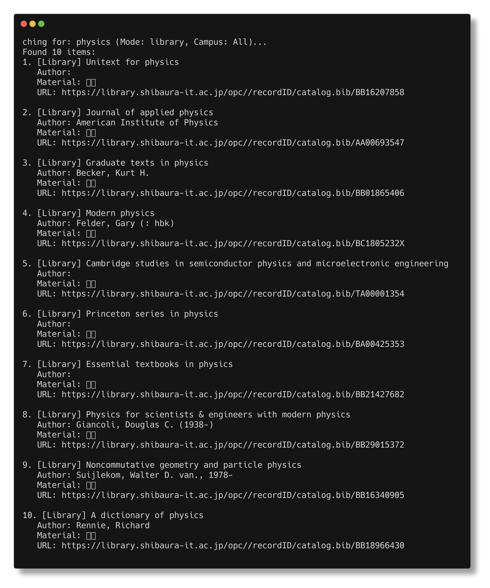
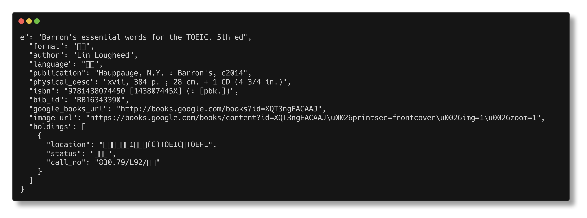

# Usage Guide

`slib-go` is a powerful tool for searching and fetching book information from the Shibaura Institute of Technology (SIT) library. It is designed to be used by both humans and AI agents.

## Modes of Operation

The program supports three main modes:
1.  **CLI Search**: For quick queries and automation.
2.  **CLI Details**: For fetching detailed information about a specific book by its ID.
3.  **Interactive TUI**: For a more user-friendly, interactive experience.

### CLI Search

Search for books by keyword. You can filter by mode (all, library, online) and campus (Toyosu, Omiya).

```bash
# Search for library books (physical books)
go run main.go -mode library physics

# Search for online publications (e-books, journals)
go run main.go -mode online physics

# Search everything (concurrently)
go run main.go -mode all physics

# Filter by campus
go run main.go -toyosu physics
go run main.go -omiya physics
```

#### Search Results Example


### CLI Details

Fetch detailed information about a book using its Bib ID (e.g., `BB16343390`).

```bash
go run main.go -id BB16343390
```

#### JSON Output (For AI Agents)

AI agents can use the `-json` flag to get machine-readable output.

```bash
go run main.go -json -id BB16343390
```



### Interactive TUI

Launch the terminal user interface for an interactive searching and browsing experience.

```bash
go run main.go tui
```

In TUI mode:
- Use `/` to focus the search input.
- Use `Enter` to search or view book details.
- Use `Arrow Keys` or `j/k` to navigate the table.
- Use `q` or `Esc` to quit.

## Installation

Ensure you have Go installed, then clone the repository and install dependencies:

```bash
git clone https://github.com/2gn/slib-go
cd slib-go
go mod download
```

## Running

You can run the program using `go run main.go` or build it:

```bash
go build -o slib
./slib tui
```
